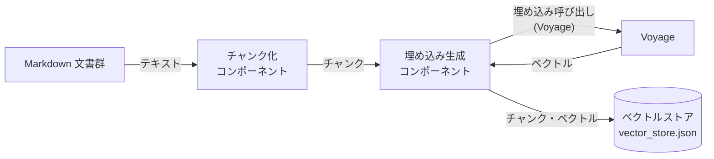
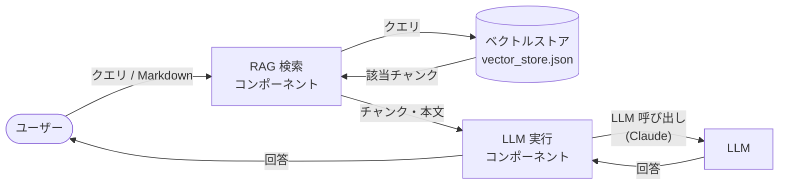
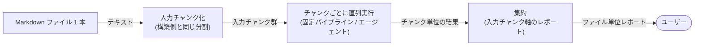
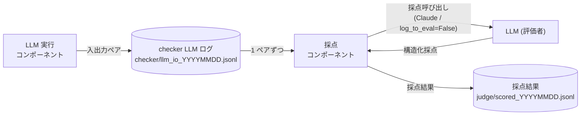
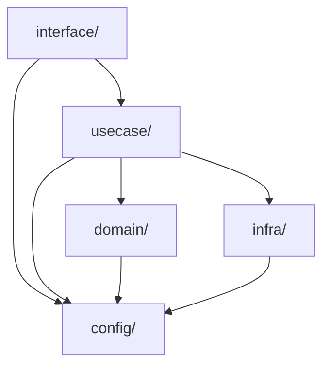

# アーキテクチャ

md-checker の全体構成と技術スタックをまとめます。各部品の細かい仕様は `design/` 配下の詳細設計を参照してください。

## 1. 全体アーキテクチャ

md-checker は「RAG 構築（事前処理・1回／文書追加時）」と「md-checker エージェント（ユーザークエリのたび）」の 2 つに分かれ、ベクトルストア（`vector_store.json`）を介してつながります。RAG 構築では、Markdown をチャンク化・ベクトル化してベクトルストアに保存します。md-checker エージェントでは、RAG で取得したチャンク・本文を元に LLM へプロンプトを投げ、類似検索や矛盾チェックの回答を得てユーザークエリに返します。

検索フェーズには **2 つの戦略**があり、同じ共通部品（検索・LLM 窓口・プロンプト）の上に乗ります。どちらも同形の結果を返すため、対話エントリ（`cli`）が切り替えて呼べます。

- **固定パイプライン**: 1 回検索 → 1 回 LLM 判定。シンプルで明快（詳細は [design/pipeline.md](design/pipeline.md)）。
- **検索エージェント**: LLM に検索を道具として持たせ、確信が持てるまで能動的に候補を集めてから判定する**ツールループ**（詳細は [design/agent.md](design/agent.md)）。

### 1.1 RAG構築



#### 1.1.1 チャンク化コンポーネント

Markdown を検索しやすい単位（チャンク）に分割・整形する。方針は以下のとおり（詳細は [design/rag-build.md](design/rag-build.md)）。

1. **一次分割**: `###`（H3）境界で分割。H3 が無いセクションは H2 単位で 1 チャンク。
   - 多くのチャンクは上限未満に収まる（短いチャンクが多くなるのは問題なし＝文脈が自然に切れている証拠）。
2. **二次分割**: 1 チャンク **上限 1200 トークン**。超過時のみ段落（空行）境界で再分割。
   - **コードブロック（```）の途中では絶対に割らない**（コードは意味の最小単位として保持）。
3. **コードブロック**: 直前の説明文と同一チャンクに保持。意味（ベクトル）検索の材料からは除去し、`content`（本文）と BM25（語彙検索）にはコード込みで残す。
4. **文脈ヘッダ**: 各チャンク本文の先頭に親見出しパス（例: `[claude-feature.md > 4. プロンプトキャッシュ > 4.2 ...]`）を付与し、文脈を失わないようにする。
5. **画像リンク** ``: 除去（埋め込みに寄与しないため）。

#### 1.1.2 埋め込み生成コンポーネント

各チャンクを **Voyage の埋め込みモデル**（外部 API 呼び出し）に渡してベクトル化する。ベクトル化に使うテキストはコードを除いた `embed_text`。コサイン類似度で意味の近さを測れるよう、テキストの意味を数値ベクトルとして表現する。

#### 1.1.3 ベクトルストア

チャンク本文・ベクトル・メタ情報を**ローカル JSON ファイル（`vector_store.json`）**に保存する簡易ストア。構造はシンプルで、トップに埋め込みモデル名、その下にチャンク（レコード）の配列を持つ。

```json
{
  "model": "voyage-4-lite",
  "records": [
    {
      "id":           "content の SHA-1 先頭12文字（内容が同じなら同じ ID）",
      "content":      "文脈ヘッダ＋本文（コード込み）",
      "embed_text":   "文脈ヘッダ＋本文（コード除去）",
      "file":         "元ファイル名",
      "heading_path": ["見出し", "..."],
      "embedding":    [0.012, -0.034, "..."]
    }
  ]
}
```

`id` は `content` の内容ハッシュ（SHA-1 先頭12文字）。同じ内容のチャンクは再構築をまたいでも同じ ID になり、ハイブリッド検索の RRF 統合で「2 つの検索が同じチャンクを返したか」の同一判定に使う。

### 1.2 md-checkerエージェント



#### 1.2.1 RAG 検索コンポーネント

クエリを元に、ベクトルストアから意味的に近いチャンクを抽出する。2 系統の検索を並行して行い、統合する（詳細は [design/pipeline.md](design/pipeline.md)）。

1. **ベクトル検索（意味）**: クエリを埋め込み、各チャンクとの**コサイン類似度**で意味の近さを測る。
2. **BM25 検索（語彙）**: モデル名・関数名・ID などの**語彙の一致**でスコアリングする。
3. **統合（RRF）**: 上記 2 つの順位を相互ランク融合（RRF）で統合してスコア付けし、最終的に意味的に近いチャンク・本文を抽出する。
4. **同名ファイルの除外（任意）**: 入力ファイルと同名（`file` 一致）の候補を結果から落とすフィルタを入口に持つ。指定が無ければ何も落とさない（テキスト単位や新規ファイル入力では実質ノーオプ）。ファイル単位入力（1.2.3）で構築済みファイルを入力したときの自己マッチ回避に使う。

#### 1.2.2 LLM 実行コンポーネント

RAG 検索コンポーネントから取得したチャンク・本文をプロンプトに埋め込んで **LLM（Claude）**（外部 API 呼び出し）を実行し、類似記載の検索や矛盾チェックの判定を得る。回答は自由文ではなく**機能ごとの tool スキーマに沿った構造化データ**（候補 id ＋判定）で受け取り、id から元チャンクを逆引きしてファイル名・見出し・本文を補ってユーザーに返す。

LLM 実行には 2 つの戦略があり、Claude を呼ぶ窓口（`infra/llm.py`）・プロンプト組立（`infra/prompt.py`）・後段の補完（`domain/retrieval/enrich.py`）を共有する。

1. **固定パイプライン**（`usecase/pipeline.py` の `analyze`）: 候補を 1 回集めて tool 強制で 1 回だけ判定させる（詳細は [design/pipeline.md](design/pipeline.md)）。
2. **検索エージェント**（`usecase/agent.py` の `run`）: `search`（追加検索）・`expand`（同一ファイルの前後取得）・`report_*`（判定確定）の 3 ツールを `tool_choice=auto` で回すツールループ。確信が持てるまで能動的に候補を集めてから確定する（詳細は [design/agent.md](design/agent.md)）。

> 2 戦略は同形の結果（`{"results": [...]}`）を返し、id 逆引きによる補完（`enrich`）も共有する。対話エントリ（`interface/cli.py`）がどちらの戦略で実行するかを切り替える。

#### 1.2.3 入力単位（テキスト／ファイル）

検索フェーズは入力を 2 通りの単位で受け取れる。どちらの単位でも、内側で使う検索・LLM 実行・補完（1.2.1／1.2.2）はそのまま共有する。

1. **テキスト単位**: 直接入力された文章（1 チャンク相当）を、そのまま 1 クエリとして上記の戦略に流す。現状の基本形。
2. **ファイル単位**: Markdown ファイル 1 本を入力し、**構築側と同じチャンク化（1.1.1）で分割**してから、**チャンクごとに上記の戦略を 1 本ずつ直列で回す**。各チャンクの検索・判定は内側で共通部品をそのまま使い、最後に**入力チャンクを軸にしたファイル単位のレポートに集約**する（詳細は [design/pipeline.md](design/pipeline.md) 8・[design/agent.md](design/agent.md)）。



- ファイル単位は **2 戦略（固定パイプライン／エージェント）のどちらでも回せる**。チャンクを 1 本ずつ流すだけなので、戦略側のループ設計には手を入れない（「共通部品の上に乗る戦略」を、さらにファイル単位ループが上から呼ぶ構造）。
- 入力ファイルが構築済みのとき（再点検用途）は、各チャンクの検索で**同名ファイルの候補を除外**（1.2.1 の除外フィルタ）して自己マッチを避ける。`search`／`expand`（エージェント）の追加検索にも同じ除外を通す。
- 検索で候補 0 件のチャンクは LLM を呼ばずにスキップし、ファイル単位でコストが膨らむのを抑える。

### 1.3 LLM出力評価

md-checker エージェントの LLM 判定（機能①②）が「捏造していないか・的外れでないか」を、後から自動で点検するための仕組み。エージェントの LLM 呼び出しのたびに入出力をログに残し、後で別の LLM（評価者）にそのログを採点させる（詳細は [design/eval.md](design/eval.md)）。



#### 1.3.1 評価用ログ記録

LLM 実行コンポーネント（1.2.2）が Claude を呼ぶたびに、送ったリクエストと返った応答をペアで**日次ファイル（`logs/checker/llm_io_YYYYMMDD.jsonl`）に追記**する。ログ書き込みの失敗で本処理（ユーザーへの回答）は止めない。入力には候補一覧を埋め込んだ完成プロンプトと tool スキーマがそのまま残るため、採点時に「どんな候補を渡して、どう答えたか」を完全に再現できる。

#### 1.3.2 採点コンポーネント（LLM-as-judge）

後からまとめて checker の LLM ログを読み、別の LLM（評価者＝**Claude**、外部 API 呼び出し）に 1 ペアずつ採点させる。正解データは用意せず、入力と出力だけを根拠に「出典の実在性・引用の実在性・判定の妥当性・取りこぼし」を評価する（reference-free 評価）。採点結果も**専用 tool スキーマに沿った構造化データ**（score / label / reason / issues）で受け取り、`logs/judge/scored_YYYYMMDD.jsonl` に書き出す。採点経路は checker の LLM 窓口（`infra/llm.run`）を **`log_to_eval=False`** で呼ぶことで本番経路と切り離し、採点呼び出し自体は checker の評価対象ログ（`logs/checker/`）に残さない（採点ログが次の採点対象に混ざるのを防ぐ）。judge 自身の LLM 入出力は別途 `logs/judge/llm_io_YYYYMMDD.jsonl` に記録する。

## 2. 技術スタック

| 用途 | 技術 |
|------|------|
| 埋め込み生成 | Voyage（埋め込みモデル） |
| 類似・矛盾判定（機能①②） | Claude（Anthropic API）。固定パイプラインと検索エージェント（ツールループ）の 2 戦略 |
| LLM 出力評価（採点） | Claude（Anthropic API）による LLM-as-judge |
| ベクトルストア | ローカル JSON ファイル（`vector_store.json`） |
| 語彙検索 | 自前 BM25（辞書不要・依存ゼロ） |
| 統合 | 自前 RRF（相互ランク融合） |
| 言語 | Python |

## 3. ディレクトリ構成

軽量クリーンアーキテクチャ（`interface → usecase → domain / infra` の一方向依存）。

```
md-checker/
├── src/                              # ソースコード
│   ├── config/
│   │   └── config.py                 # 設定・定数の集約点（モデル名・パス・各種パラメータ）
│   ├── interface/                    # ユーザー受付・結果表示
│   │   ├── cli.py                    # 対話エントリ（機能選択→戦略切替→入力単位（テキスト/ファイル）切替→実行→表示）
│   │   └── file_input.py             # ファイル単位入力（分割→チャンクごとに戦略を回す→レポート集約）
│   ├── usecase/                      # 処理フローの組み立て
│   │   ├── rag_build.py              # RAG 構築（チャンク化→埋め込み→ストア保存）
│   │   ├── pipeline.py               # 戦略①: 固定パイプライン（analyze）
│   │   ├── agent.py                  # 戦略②: 検索エージェント（run。search/expand/report のツールループ）
│   │   └── judge.py                  # LLM 出力評価（LLM-as-judge による採点）
│   ├── domain/                       # 純粋ロジック（外部依存ゼロ。config 参照のみ可）
│   │   ├── chunking.py               # Markdown チャンク化（chunk_markdown_file）
│   │   └── retrieval/                # bm25 / cosine / hybrid / expand / enrich
│   └── infra/                        # 外部 API・永続化・テンプレート読込
│       ├── embedder.py               # Voyage 埋め込み呼び出し
│       ├── llm.py                    # Claude への窓口（run/complete）＋ checker LLM 入出力ログ記録
│       ├── store.py                  # ベクトルストア読み込み（load_records / get_index）
│       ├── prompt.py                 # プロンプト組立（候補整形・txt 埋め込み）
│       ├── tools.py                  # tool スキーマ（report_* / search / expand / judge）
│       └── logger.py                 # トレースログ（create / write）
├── resources/                        # データ・素材
│   ├── target_mds/                   # 構築フェーズの入力 Markdown 群
│   ├── prompts/                      # プロンプト txt（similarity / contradiction / judge / agent_*）
│   └── store/                        # ベクトルストア出力先（vector_store.json）
├── logs/                             # 実行ログ（成果物）
│   ├── trace/                        # アプリ実行ログ（.log トレース）
│   ├── checker/                      # checker の LLM 入出力ペア（llm_io_*.jsonl。評価の素材）
│   └── judge/                        # judge の採点結果 scored_* と LLM 入出力 llm_io_*
├── docs/                             # ドキュメント
│   ├── overview.md                   # 概要・要件
│   ├── architecture.md               # 本書（全体構成・技術スタック）
│   ├── design/                       # 詳細設計
│   │   ├── rag-build.md              # RAG 構築の設計
│   │   ├── pipeline.md               # 固定パイプラインの設計
│   │   ├── eval.md                   # LLM 出力評価の設計
│   │   └── agent.md                  # 検索エージェント（ツールループ）の設計
│   └── reference/                    # 参考資料
├── .env                              # API キー（VOYAGE_API_KEY / ANTHROPIC_API_KEY）
├── .env-example                      # .env のひな形
├── pyproject.toml                    # プロジェクト定義・依存（Poetry, package-mode=false）
└── poetry.lock                       # 依存の固定版（poetry install が解決）
```

## 4. パッケージ依存ルール

`src/` 配下は軽量クリーンアーキテクチャに沿って 4 層へ分かれ、依存は **`interface → usecase → domain / infra`** の一方向のみとする。

- `interface/` … ユーザー受付・結果表示（`cli` / `file_input`）。`usecase` を呼ぶ。
- `usecase/` … 処理フローの組み立て（`rag_build` / `pipeline` / `agent` / `judge`）。`domain` と `infra` を組み合わせる。
- `domain/` … 純粋ロジック（`chunking` / `retrieval/*`）。**外部依存ゼロが原則**で、参照してよいのは `config` のみ。
- `infra/` … 外部 API・永続化・テンプレート読込（`embedder` / `llm` / `store` / `prompt` / `tools` / `logger`）。

**ルール:**

- 依存は上位から下位への一方向のみ。`domain` / `infra` は `usecase` / `interface` を参照しない。
- `usecase` 同士・`interface` 同士の直接参照は増やさない。新しい共有ロジックは `domain` または `infra` に置く。
- `config/` … 設定・定数の集約点。どの層からも参照してよい。



**理由:** 上位（フロー・UI）と下位（純粋ロジック・外部 I/O）を疎結合に保ち、外部 API やストア形式の変更が `usecase` のフローへ波及しないようにする。構築・検索の双方で使う Markdown チャンク化器 `chunk_markdown_file` のような共有ロジックは、いずれかの `usecase` に置いて他方から参照させるのではなく、**`domain` に寄せて双方が `domain` 経由で使う**（`domain/chunking.py` に置くのはこの方針による）。
