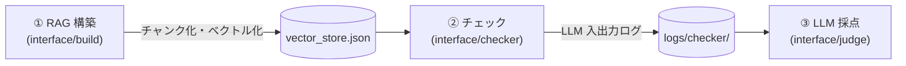
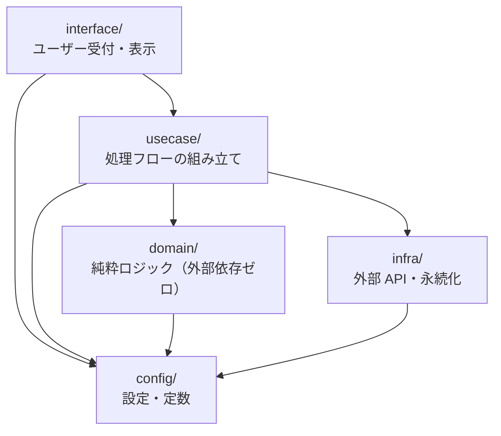

# アーキテクチャ

md-checker の全体構成と技術スタックをまとめます。各部品の詳細仕様は `docs/design/` 配下を参照してください。

## 1. 全体アーキテクチャ

md-checker は **3 つのユースケース**で構成され、すべてベクトルストア（`vector_store.json`）を介してつながります。



| # | ユースケース | タイミング | 詳細設計 |
|---|---|---|---|
| ① | **RAG 構築** | 文書追加・変更時に 1 回 | [design/rag-build.md](design/rag-build.md) |
| ② | **チェック**（類似検索 / 矛盾チェック） | クエリのたびに | [design/agent.md](design/agent.md) |
| ③| **LLM 採点**（LLM-as-judge） | 任意・後からまとめて | [design/eval.md](design/eval.md) |

## 2. レイヤー構成（クリーンアーキテクチャ）

`src/` は **4 層**に分かれ、依存は `interface → usecase → domain / infra` の**一方向のみ**です。



| 層 | 責務 | モジュール |
|---|---|---|
| `interface/` | ユーザー受付・結果表示 | `build`, `checker`, `judge` |
| `usecase/` | 処理フローの組み立て | `rag_build`, `agent`, `judge` |
| `domain/` | 純粋ロジック（外部依存ゼロ） | `chunking`, `retrieval/*` |
| `infra/` | 外部 API・永続化・テンプレート読込 | `embedder`, `llm`, `store`, `prompt`, `tools` |
| `config/` | 設定・定数の集約点（全層から参照可） | `config` |

**ルール:**
- 依存は上位 → 下位の一方向のみ。`domain` / `infra` は `usecase` / `interface` を参照しない。
- `usecase` 同士・`interface` 同士の直接参照は増やさない。共有ロジックは `domain` または `infra` に置く。
- `domain` は外部ライブラリへの依存ゼロが原則（`config` 参照のみ可）。

## 3. ディレクトリ構成

```
md-checker/
├── src/
│   ├── config/
│   │   └── config.py                 # 設定・定数の集約点
│   ├── interface/                    # ユーザー受付・結果表示
│   │   ├── build.py                  # RAG 構築のエントリ
│   │   ├── checker.py                # チェック実行（対話 CLI）
│   │   └── judge.py                  # LLM 採点のエントリ
│   ├── usecase/                      # 処理フローの組み立て
│   │   ├── rag_build.py              # RAG 構築（チャンク化→埋め込み→ストア保存）
│   │   ├── agent.py                  # 検索エージェント（ツールループ）
│   │   └── judge.py                  # LLM 採点（LLM-as-judge）
│   ├── domain/                       # 純粋ロジック（外部依存ゼロ）
│   │   ├── chunking.py               # Markdown チャンク化
│   │   └── retrieval/                # bm25 / cosine / hybrid / expand
│   └── infra/                        # 外部 API・永続化・テンプレート読込
│       ├── embedder.py               # Voyage 埋め込み呼び出し
│       ├── llm.py                    # Claude 呼び出し窓口 + LLM 入出力ログ記録
│       ├── store.py                  # ベクトルストア読み込み（get_index）
│       ├── prompt.py                 # プロンプト組立
│       └── tools.py                  # tool スキーマ定義
├── resources/
│   ├── target_mds/                   # 構築フェーズの入力 Markdown 群
│   ├── prompts/                      # プロンプト txt
│   └── store/                        # vector_store.json の出力先
├── logs/
│   ├── checker/                      # checker の LLM 入出力ペア（評価の素材）
│   └── judge/                        # 採点結果 scored_* と LLM 入出力 llm_io_*
├── docs/
│   ├── overview.md
│   ├── architecture.md               # 本書
│   ├── design/
│   │   ├── rag-build.md
│   │   ├── agent.md
│   │   └── eval.md
│   └── reference/
├── .env
├── .env-example
├── pyproject.toml
└── poetry.lock
```

## 4. 技術スタック

| 用途 | 技術 |
|---|---|
| 埋め込み生成 | Voyage API（`voyage-4-lite`） |
| 類似・矛盾判定 | Claude（Anthropic API）— ツールループによる検索エージェント |
| LLM 出力評価 | Claude（Anthropic API）— LLM-as-judge |
| ベクトルストア | ローカル JSON（`vector_store.json`）— 専用 DB 不要 |
| 語彙検索 | 自前 BM25（辞書不要・外部依存ゼロ） |
| 検索統合 | 自前 RRF（相互ランク融合） |
| 言語 | Python / Poetry |
