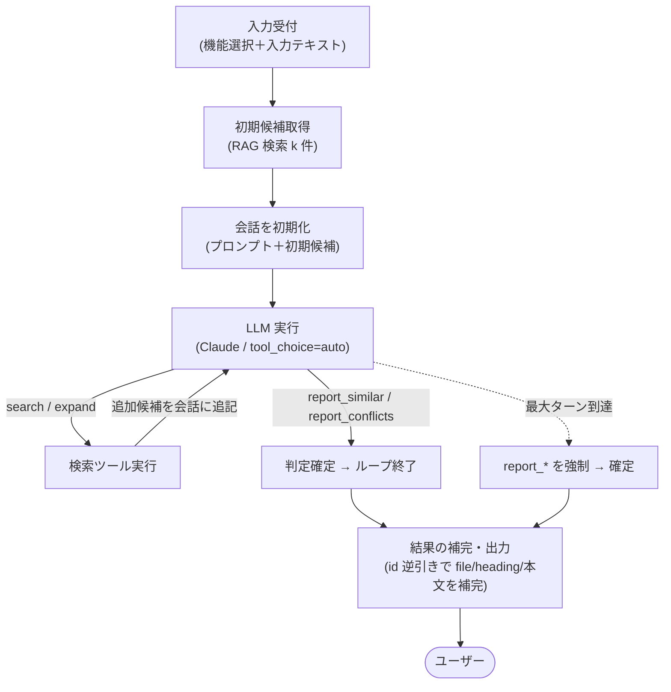

# 検索エージェント 設計

md-checker の **エージェント版検索フェーズ**（類似検索／矛盾チェックを、検索と判定を分けず 1 本のツールループで回す処理）のコード設計をまとめます。現状の固定パイプライン（[pipeline.md](pipeline.md)）が「1 回検索 → 1 回 LLM 判定」で終わるのに対し、本設計では LLM 自身に検索を道具として持たせ、確信が持てるまで能動的に候補を集めてから判定を出させます。全体の中での位置づけは [../architecture.md](../architecture.md) の「1.2 md-checker エージェント」を参照。

機能①（類似記載の検索）と機能②（矛盾チェック）は、現状パイプラインと同じく**同じループを共有**し、使うプロンプトと判定ツールだけが違います。

## 1. 概要

### 1.1 目的・対象範囲

エージェント版検索フェーズは、現状パイプラインの固定 3 段（候補取得 → プロンプト構築・LLM 実行 → 補完・出力）のうち、**「候補取得」と「LLM 実行」をツールループに統合**したものです。本ドキュメントはこのループの処理ロジックを定義します。

現状パイプラインからの差分は次のとおりで、それ以外（入力受付・id 逆引きによる補完・出力）は据え置きます。

| | 現状パイプライン（[pipeline.md](pipeline.md)） | 本設計（エージェント） |
|---|---|---|
| 候補取得 | クエリ 1 回で k 件、固定 | 初期候補に加え、LLM が `search` / `expand` で能動的に追加取得 |
| LLM 実行 | tool 強制で 1 回だけ判定 | ツールループ。LLM が「検索する／判定を確定する」を自分で選ぶ |
| 終了 | 1 回で必ず終わる | `report_*`（判定確定）が呼ばれる、または最大ターン数で打ち切り |
| 補完・出力 | id 逆引きで file/heading/本文を補う | **変更なし**（現状の後段をそのまま再利用） |

### 1.2 解決したい弱点

現状パイプラインを縛っている 3 点を、ツールループで解く。

1. **検索が 1 回きり**: 入力をそのまま 1 クエリにするため、複数の主張を含む長文だと一部の主張の候補を取りこぼす。→ `search` で言い換え・分解して引き直せる。
2. **LLM が受け身**: 渡された候補を判定するだけで、文脈不足を自分で補えない。→ `expand` で同一ファイルの前後を取り寄せられる。
3. **文脈不足での誤判定**: 矛盾チェックは「数値・既定値が食い違う」を確信するのに定義箇所が要ることが多い。候補本文だけでは過検出・見落としが起きる。→ `expand` で定義箇所を取りに行ける。

### 1.3 処理フロー



### 1.4 実行タイミング・入力

- **入力**: 使う機能（類似検索／矛盾チェック）の選択と、入力単位（テキスト／ファイル）・対象（現状パイプラインと同じ。[pipeline.md](pipeline.md) 2）。
- **実行**: ユーザーのクエリのたびに 1 回（ただし内部では複数ターンの LLM 呼び出しが起きうる）。ファイル単位入力では、入力チャンクの数だけこのループを直列に回す（[10](#10-ファイル単位入力)）。
- **前提**: 事前にベクトルストアが構築済みであること（構築は [rag-build.md](rag-build.md)）。

### 1.5 現状パイプラインとの関係

本設計は現状パイプラインを置き換えるのではなく、**固定パイプラインと並ぶもう 1 つの「戦略」**として追加する。固定パイプラインの `analyze` と、エージェントの `run` は、同じ共通部品（検索・LLM 窓口・プロンプト）の上に乗り、**同じ戻り値（`{"results": [...]}`）を返す**。呼び出し側はどちらの戦略を使うかを切り替えるだけで、後段（補完・表示）は共通のまま使える（[2](#2-コード構成と共通化)）。

入力が短い単一主張なら、LLM は初手で `report_*` を選べる（＝実質 1 ターンで現状と同等に終わる）ことを狙いとする。

> ループを持たせても「最初の候補で確信できれば即確定」を許すことで、簡単な入力に過剰なコストをかけない。エージェント化は精度の上限を上げるものであって、毎回コストを増やすものではない。

## 2. コード構成と共通化

固定パイプラインとエージェントは大半の処理を共有する。そこで両者を「共通部品の上に乗る 2 つの戦略」として並べ、共通部品を使い回せるようにする。

### 2.1 フォルダ構成

md-checker は軽量クリーンアーキテクチャ（`interface → usecase → domain / infra`）を採る。2 戦略（固定パイプライン／エージェント）は `usecase/` に並べ、両者が使う**共通部品**は `domain` / `infra` に置く。

```
src/
├── interface/
│   ├── cli.py               # 対話エントリ（機能選択→入力→戦略切替→表示）
│   └── file_input.py        # ファイル単位入力（分割→チャンクごとに戦略→集約）
├── usecase/
│   ├── pipeline.py          # 戦略①: 固定パイプライン（analyze）
│   ├── agent.py             # 戦略②: ツールループ（run）
│   ├── rag_build.py / judge.py
├── domain/
│   ├── chunking.py          # Markdown チャンク化（共通）
│   └── retrieval/           # 候補を集める（共通）: hybrid / cosine / bm25 / expand / enrich
├── infra/                   # llm（Claude 窓口＋checker LLM ログ）/ prompt / tools / store / embedder / logger
└── config/
```

- `domain/retrieval`（ハイブリッド検索・`expand`・`enrich`）と `infra`（`llm` / `prompt` / `tools`）は、固定パイプラインとエージェントの**両方が同じように使う共通部品**。
- `pipeline.py` と `agent.py` は `usecase/` に並ぶ別戦略。どちらも `domain` / `infra` を import して使う（「パイプラインの下にエージェント」ではなく「共通部品の上に 2 戦略」）。

### 2.2 LLM 窓口の 2 層化（`run` と `complete`）

共通部品の要は LLM 窓口（`infra/llm.py`）。現状の「1 回だけ判定して返す」呼び出しを、エージェントのループでも使えるよう 2 層に分ける。

| 関数 | 役割 | 使う側 |
|---|---|---|
| `run(messages, tools, tool_choice)` | 会話列と複数ツールを渡し、Claude 応答をそのまま返す**汎用 1 ターン**。評価用ログ（[eval.md](eval.md)）の記録もここで 1 回行う | エージェントがループで繰り返し呼ぶ |
| `complete(prompt, tool_schema)` | 単一プロンプト＋単一スキーマを tool 強制で `run` に 1 回通し、`tool_use.input` を取り出して返す（**現状互換の薄いラッパ**） | 固定パイプライン |

> 評価用ログの記録を `run` の中に集約することで、固定パイプライン（`complete` 経由）もエージェント（`run` 直接）も、自動で同じ評価対象に乗る。これにより両戦略を LLM-as-judge（[eval.md](eval.md)）で**同一の物差しで前後比較**できる。エージェントは 1 クエリで `run` を複数回呼ぶため、評価用ログにもペアが複数行残る（[7](#7-ログ)）。

### 2.3 プロンプト・候補整形の共有

1. `report_similar` / `report_conflicts` の tool スキーマは `infra/tools.py` のものをそのまま使う。エージェントはこれに `search` / `expand` を足したツール配列（`agent_tools(mode)`）を渡す（ツール定義は [3](#3-ツール定義)）。
2. 候補ブロックの整形（id・ファイル名・見出し・本文）も `infra/prompt.py` の `build_candidates_block` を流用する。エージェントは初期候補だけでなく、`search` / `expand` の結果整形にも同じ関数を使う。

### 2.4 対話エントリの共通化（`cli.py`）

1. 機能選択・入力受付・入力検査・結果表示は `interface/cli.py` に置き、固定パイプラインとエージェントで共通にする。
2. cli は「どの戦略で実行するか」（`pipeline.analyze` か `agent.run` か）を選んで呼び、返ってきた `{"results": [...]}` を機能ごとの体裁で表示する。
3. 両戦略の戻り値が同形なので、表示ロジックは戦略を意識しない。

> 表示・入力受付は戦略によらず同じ。ここを cli に集約することで、固定パイプライン側に表示ロジックが残らず、戦略の追加・切替が表示に波及しない。

## 3. ツール定義

LLM には次の 3 種のツールを渡す。`search` / `expand` は候補を増やす道具、`report_*` は判定を確定させる終了シグナル。

### 3.1 `search` — 能動的な再検索

1. LLM が組み立てたクエリでハイブリッド検索（[pipeline.md](pipeline.md) 3）を呼び、**まだ会話に出していない候補だけ**を id 付きで返す。
2. 既に提示済みの候補（id 一致）は本文を再掲せず、新規候補が無ければ「新しい候補はありません」とだけ伝える。
3. ファイル単位入力で構築済みファイルを入力したときは、初期候補と同じ**同名ファイルの除外**（[pipeline.md](pipeline.md) 3、[10.2](#102-同名ファイルの除外)）を `search` の検索にも通す。これを忘れるとエージェントが自己マッチを拾い直してしまう。

| 引数 | 内容 |
|---|---|
| `query` | 検索クエリ。入力の言い換え、特定の主張の抜き出しなど、LLM が自由に組み立てる |

> 取得件数は LLM に選ばせず、config の `AGENT_SEARCH_K`（既定 5）で固定する。会話が膨らみすぎないよう控えめにする。

> LLM が長い入力を主張ごとに分解して引き直せるようにするのが狙い。重複除去で、同じ候補を何度も本文付きで積まないようにし、トークンと混乱を抑える。

### 3.2 `expand` — 文脈の取り寄せ

1. 指定された候補 id と**同じファイルのチャンク**を、ファイル内の出現順（見出しパス順）で取り寄せて返す。
2. 取り寄せ範囲は `scope` で選ぶ。

| 引数 | 内容 |
|---|---|
| `id` | 起点となる候補の id（提示済みのもの） |
| `scope` | `neighbors`（前後の数チャンク。既定）／ `same_file`（同ファイル全チャンク） |

> 矛盾チェックでは「候補の数値が、同じ章の定義とどう違うか」を見ないと確信できないことが多い。`expand` はその定義箇所を取りに行くための道具。
> 取り寄せの索引（ファイル内の出現順）は [5.3](#53-store-索引expand-用) で用意し、毎回作り直さない。

### 3.3 `report_similar` / `report_conflicts` — 判定確定（終了シグナル）

1. 判定が確定したら、機能ごとの **tool スキーマに沿った構造化データ**（候補 id ＋判定）を返させる。**現状パイプラインの tool スキーマをそのまま流用する**（[pipeline.md](pipeline.md) 4.3、`src/infra/tools.py`）。
2. このツールが呼ばれたら**ループを終了**し、その入力（ツールに渡された引数）を最終結果として確定する。

- **類似検索（`report_similar`）**: 各要素は「候補の id・似ている点の説明・該当箇所の短い引用」。
- **矛盾チェック（`report_conflicts`）**: 各要素は「候補の id・入力側の主張・既存文書側の食い違う記載・矛盾の理由」。

> 出典はファイル名・見出しではなく候補の `id` で参照させる方針も現状どおり。file/heading/本文は後段（[6](#6-結果の補完出力)）で id から逆引きして補う。

### 3.4 ツール選択モード

- 現状パイプラインは `report_*` を**強制呼び出し**していたが、本設計では `tool_choice=auto` にし、LLM が「まだ調べる（`search`/`expand`）」か「確定する（`report_*`）」かを自分で選べるようにする。
- ただし**ループ打ち切り時のみ強制呼び出し**に切り替える（[4.3](#43-終了条件と打ち切り)）。

## 4. ツールループ

### 4.1 会話の初期化

1. 入力テキストでハイブリッド検索を 1 回行い、**初期候補 k 件**を集める（現状パイプラインの 1 回検索に相当）。
2. システムプロンプト（行動指針）＋入力テキスト＋初期候補を最初のユーザーメッセージに組み立てる。候補の整形（id・ファイル名・見出し・本文）は共通の候補ブロック整形（`build_candidates_block`、[2.3](#23-プロンプト候補整形の共有)）を再利用する。
3. 提示した候補の id を覚えておく（`sent_ids`）。`search` の重複除去と、出典の実在性チェック（[4.4](#44-出典の実在性チェック)）に使う。
4. 候補が初期検索で 0 件でも、LLM が `search` で引き直せるため、即「該当なし」とはしない（`search` も 0 件なら最終的に空で確定）。

### 4.2 ループ本体

LLM 窓口の `run`（[2.2](#22-llm-窓口の-2-層化run-と-complete)）を `tool_choice="auto"` で繰り返し呼ぶ。

1. メッセージ列・全ツール・`tool_choice="auto"` を `run` に渡して Claude を呼び、応答をメッセージ列に追記する。
2. 応答の `tool_use` を処理する。
   - `search` / `expand`: 対応する検索を実行し、結果（既出 id を除いた候補・取り寄せた文脈）を `tool_result` として会話に追記して**次ターンへ**。提示した候補の id は `sent_ids` に足す。
   - `report_*`: その入力を最終結果として確定し、**ループを抜ける**。
3. ツール実行のたびに、追加候補・呼び出し内容をトレースログに記録する（[7](#7-ログ)）。評価用ログは `run` の中で自動的に残る（[2.2](#22-llm-窓口の-2-層化run-と-complete)）。

### 4.3 終了条件と打ち切り

ループは次のいずれかで終わる。暴走・コスト膨張・捏造を防ぐためのガードを置く。

| ガード | 方針 |
|---|---|
| **最大ターン数** | `MAX_AGENT_TURNS`（既定 5）。到達したら、その時点の会話で `report_*` を**強制呼び出し**（`run` に `tool_choice` を強制で渡す）し、必ず結果を出す |
| **検索回数上限** | `search` / `expand` の累計呼び出し回数に上限（`MAX_TOOL_CALLS`、既定 6）を設ける。超えたらツール結果に「これ以上は検索できない。判定を確定して」と添える |

> 必ず結果を返すために、最後はツールを強制してでも `report_*` を出させる。検索が無限に続いたり、判定を出さずに終わるのを防ぐ。

### 4.4 出典の実在性チェック

1. `report_*` の各要素は、**提示済みの候補（`sent_ids` / `sent_records`）の id でしか参照できない**。出典はファイル名・見出しではなく id に限定する。
2. 後段（[6](#6-結果の補完出力)）の id 逆引き（`enrich`）で、`sent_records` に存在しない id の要素は**捨てる**（取り違え・捏造の最終防波堤）。

> 出典を「提示済み候補の id」に縛り、補完時に実在しない id を落とすことで、実在しないファイル名・見出しの捏造を物理的に排除する。

## 5. 検索基盤の使い回し

### 5.1 ハイブリッド検索の共有

1. `search` ツールは現状のハイブリッド検索（ベクトル＋ BM25 を RRF 統合。[pipeline.md](pipeline.md) 3）をそのまま呼ぶ。判定ロジックは検索基盤を意識しない。

### 5.2 索引の使い回し

1. 1 回のクエリ処理（ループ）の中で `search` が複数回呼ばれても、ベクトルストアの読み込みと BM25 索引づくりを**毎回やり直さない**よう、一度用意して使い回す。

> `search` のたびに store ロードと BM25 索引構築が走るとコストがかさむ。ループでは検索回数が増えるため、ここを使い回さないとコストが効いてくる。

### 5.3 store 索引（`expand` 用）

1. `expand` のために、**ファイルごとにチャンクを出現順に並べた索引**を用意する。出現順は **store のレコード順をそのまま信頼する**（追加メタは持たない）。
2. id から「同じファイルの何番目か」を引けるようにし、`neighbors`（前後）／`same_file`（全件）を取り出す。
3. この索引もループ内で使い回す（毎回作らない）。

> RAG 構築（[rag-build.md](rag-build.md)）は、ファイルをファイル名順に処理し、各ファイル内を見出しの出現順にチャンク化して records に積む。`zip` で順序を保ったまま保存するため、**store の records 順 = ファイル名順 × ファイル内の見出し出現順**になる。よって同じ `file` を持つ records を records 順のまま並べれば、それが `expand` の前後関係になり、追加のメタ（チャンク連番など）は要らない。

## 6. 結果の補完・出力

1. ループが確定した `report_*` の結果（id ＋判定）から、`agent.run` は固定パイプラインと同形の `{"results": [...]}` を組み立てて返す。id 逆引き（元チャンクの file/heading/本文を補い、存在しない id を捨てる）は現状パイプラインの後段（[pipeline.md](pipeline.md) 5）と同じ処理を使う。
2. 表示は対話エントリ（`cli.py`、[2.4](#24-対話エントリの共通化clipy)）が担う。cli は戦略（`pipeline.analyze` / `agent.run`）を切り替えて呼び、返ってきた `{"results": [...]}` を機能ごとの体裁で表示する。結果が無ければ「該当なし」を表示する。

> 戻り値を固定パイプラインと同形にすることで、補完・表示を戦略によらず共通化できる。エージェント化の変更を後段・表示に波及させない。

## 7. ログ

トレースログは固定パイプラインと同じ仕組み（`infra/logger.py` の `create` ＋ `logger.write`、出力先 `logs/trace/`）を使い、ループの観測点を増やす。

1. 初期候補、各ターンの LLM 応答（選んだツール）、`search`/`expand` の呼び出しと追加候補数、最終確定結果を記録する。
2. **ターン数・累計検索回数**を記録し、コストとループ挙動を後から確認できるようにする。
3. checker の LLM 入出力ログ（[eval.md](eval.md)、`logs/checker/llm_io_*.jsonl`）は `infra/llm.run` の中で LLM 呼び出しごとに残る。ループでは 1 クエリで複数回 LLM を呼ぶため、ペアも複数行記録される。

> ループは挙動が見えにくいので、必ず観測可能にしておく。打ち切り発動・差し戻しの有無もログに残す。

## 8. パラメータ

値は 1 箇所（config）に集約し、後から調整しやすくする。現状パイプラインのパラメータ（[pipeline.md](pipeline.md) 6）に加えて次を持つ。

| パラメータ | 既定値 | 説明 |
|---|---|---|
| 初期候補件数 k | 5 | ループ開始時に渡す候補数（`CANDIDATE_K`）。少なめにし、不足分は `search` で補う前提 |
| 最大ターン数 | 5 | LLM 呼び出しの上限（`MAX_AGENT_TURNS`、[4.3](#43-終了条件と打ち切り)）。到達時は `report_*` 強制 |
| 検索回数上限 | 6 | `search`/`expand` の累計上限（`MAX_TOOL_CALLS`、[4.3](#43-終了条件と打ち切り)） |
| `search` 取得件数 | 5 | 1 回の `search` で返す候補数（`AGENT_SEARCH_K`、[3.1](#31-search--能動的な再検索)） |
| `expand` 前後件数 | 2 | `neighbors` で取る前後チャンク数（`EXPAND_NEIGHBORS`、前後それぞれ。[3.2](#32-expand--文脈の取り寄せ)） |

> ループ系のパラメータ（最大ターン・検索回数）は精度とコストのトレードオフを直接握る。eval（[eval.md](eval.md)）で前後比較しながら詰める。

## 9. プロンプトの変更

1. 行動指針を `similarity.txt` / `contradiction.txt`（または専用のシステムプロンプト）に追記する。
   - 渡された候補で確信が持てなければ `search`（言い換え検索）・`expand`（前後の文脈取得）が使えること。
   - **確信したら必ず `report_*` で確定**し、だらだら検索を続けないこと。
   - 候補に無い情報は作らないこと（現状の指示を維持）。
2. 判定基準そのもの（何を類似／矛盾とするか）は現状の文面をそのまま活かす。

> 文面の調整がコードを触らずにできる方針（[pipeline.md](pipeline.md) 4.2）は維持する。エージェント化で増えるのは「いつ検索し、いつ確定するか」の行動指針だけ。

## 10. ファイル単位入力

入力をテキスト 1 本ではなく **Markdown ファイル 1 本**にする場合、固定パイプラインと同じく（[pipeline.md](pipeline.md) 7）、**ツールループ本体の外側に「分割」と「集約」を 1 枚かぶせる**だけにする。ループ本体（[4](#4-ツールループ)）・ツール定義（[3](#3-ツール定義)）・終了ガード（[4.3](#43-終了条件と打ち切り)）には手を入れない。

### 10.1 流れ

1. **入力チャンク化**: 入力ファイルを RAG 構築側と同じチャンク化器（[rag-build.md](rag-build.md) 2）で分割する。粒度がストアと揃う。
2. **入力チャンクごとにループを 1 本ずつ直列実行**: 各入力チャンクの本文を「入力テキスト」として、会話の初期化（[4.1](#41-会話の初期化)）→ツールループ（[4.2](#42-ループ本体)）→確定（[4.3](#43-終了条件と打ち切り)）を回す。チャンクごとに会話・`sent_ids`・索引（[5](#5-検索基盤の使い回し)）は独立。
3. **集約**: チャンクごとの確定結果（[6](#6-結果の補完出力) の `{"results": [...]}`）を、**どの入力チャンク（入力側の見出しパス）に対する結果か**を添えて束ね、ファイル単位のレポートにする。出力形式は固定パイプラインと共通（[pipeline.md](pipeline.md) 7.3）。

> 固定パイプラインとエージェントは「分割・集約」を共有し、間に挟む戦略（本体 1 回 か ツールループ か）だけが違う。ファイル単位入力でも 2 戦略の同形性は保たれる。

### 10.2 同名ファイルの除外

入力ファイルが構築済み（再点検用途）のときは、自己マッチを避けるため**初期候補・`search`・`expand` のすべてで同名ファイルを除外**する（[pipeline.md](pipeline.md) 3、[3.1](#31-search--能動的な再検索)）。

- 初期候補取得（[4.1](#41-会話の初期化)）に入力ファイル名を除外対象として渡す。
- `search`（[3.1](#31-search--能動的な再検索)）の追加検索にも同じ除外を通す。除外を忘れると、初期候補で防いだ自己マッチをエージェントが拾い直す。
- `expand`（[3.2](#32-expand--文脈の取り寄せ)）は「提示済み候補 id の同一ファイル」を取り寄せる道具なので、除外済みの候補が起点になることはない（自己ファイルの id はそもそも `sent_ids` に入らない）。新規ファイル入力では除外対象が無く、いずれも素通り。

### 10.3 コスト上の注意

ファイル単位入力では入力チャンクの数だけループが直列に走り、各ループはさらに複数ターン回りうる（[4.2](#42-ループ本体)）。テキスト 1 本に比べてコスト・レイテンシが大きく増える。

- 初期候補が（除外後に）0 件のチャンクは、`search` を許す前に「該当なしで確定」へ倒すなど、空チャンクで無駄にループを回さない運用にする。
- ファイル全体のコストが読みにくくなるため、戦略の選択（固定パイプライン／エージェント）はコスト許容度で決める。再点検のように網羅性が要る用途ではエージェント、ざっと見るなら固定パイプライン、のような使い分けが現実的。

## 11. 効果測定

1. 同じ入力セットで、現状パイプラインと本設計を LLM-as-judge（[eval.md](eval.md)）で採点比較する。
   - 指標: judge の `score` 平均、`bad`（捏造あり）率、矛盾チェックの過検出。
2. 代償（ターン数・追加検索回数・入力トークン増）をログ（[7](#7-ログ)）から集計し、精度向上とコストを並べて評価する。

> 評価基盤（eval）が既にあるのが本プロジェクトの強み。エージェント化は「入れて終わり」ではなく、前後比較で効果と代償を数値で確かめてから採用・調整する。

## 12. トレードオフ・スコープ

- **コスト増**: ターンごとに会話全体（積んだ候補込み）が入力に乗るため、入力トークンが増える。最大ターン数・候補トークン上限・重複除去で抑える。ファイル単位入力ではチャンク数ぶん直列に増える（[10.3](#103-コスト上の注意)）。
- **レイテンシ増**: LLM 呼び出しが複数回直列になる。小規模（50 ファイル未満）・対話用途では許容範囲とする。
- **複雑性増**: 「1 回で終わる」明快さは失われる。だからこそ打ち切りガード（[4.3](#43-終了条件と打ち切り)）とログ（[7](#7-ログ)）で挙動を必ず観測可能にする。
- **ファイル単位入力の範囲**: 入力ファイルを**チャンクに分割して 1 本ずつ直列にループへ流す**方式までを本設計の範囲とする（[10](#10-ファイル単位入力)）。
- **スコープ外**: 入力を主張ごとに分解して**並列**調査・統合する方式（計画→並列調査→統合）は、ファイル単位入力の直列実行でコスト・レイテンシが問題になったときに別途検討する。本設計は（チャンクごとであれ）単一ループでの能動検索に絞る。

## 13. 関連ドキュメント

- [../architecture.md](../architecture.md) — 全体構成（1.2 md-checker エージェント）
- [pipeline.md](pipeline.md) — 本設計が拡張する現状の分析パイプライン（候補取得・判定・補完の共通骨格）
- [rag-build.md](rag-build.md) — `search`/`expand` が使うベクトルストアの構築側の設計
- [eval.md](eval.md) — エージェント化の効果を前後比較する LLM 出力評価
