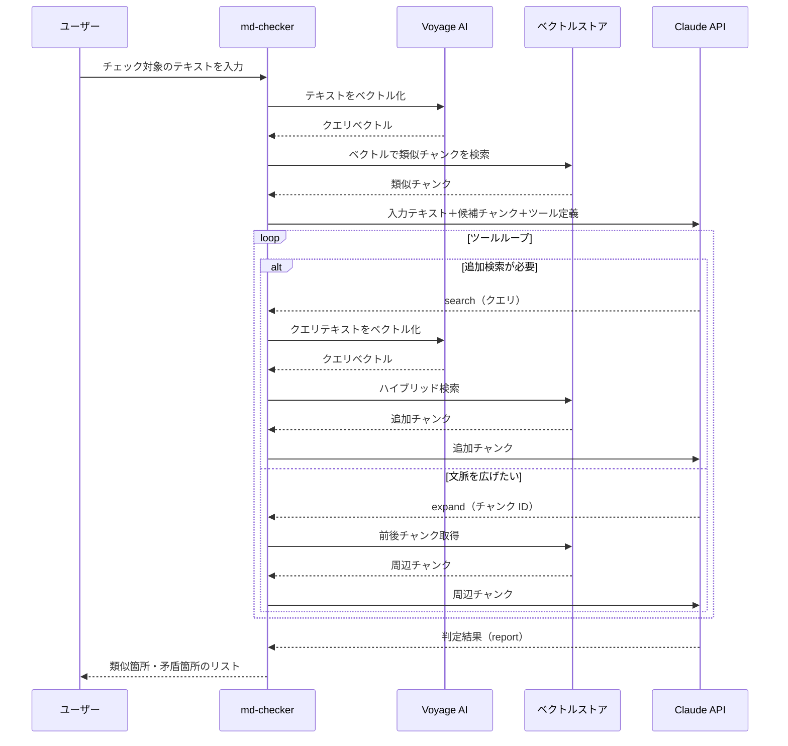

# 検索エージェント 設計

md-checker の **検索フェーズ**（類似検索／矛盾チェックを、検索と判定をツールループで回す処理）のコード設計をまとめます。全体の中での位置づけは [../architecture.md](../architecture.md) の「1.2 md-checker エージェント」を参照。

機能①（類似記載の検索）と機能②（矛盾チェック）は、**同じループを共有**し、使うシステムプロンプトと判定ツールだけが違います。

## 1. 処理フロー

クエリが入力されるたびに、md-checker が能動的に候補を集めながら判定します。処理の流れはこうです。

1. ユーザーがチェック対象のテキストを入力する
2. md-checker が入力テキストを Voyage AI に送信してクエリベクトルを取得する
3. md-checker がそのベクトルを使ってベクトルストアをハイブリッド検索（セマンティック検索 + BM25）し、初期候補を収集する
4. 入力テキスト＋候補チャンク＋ツール定義を Claude API に渡してエージェンティックループを開始する
   - 追加検索が必要な場合 → `search` ツールを実行
     - Claude が新しいクエリテキストを生成して返す
     - md-checker がクエリテキストをベクトル化し、ハイブリッド検索を実行する
     - 実行結果のチャンクを Claude に送る
   - 文脈を広げたい場合 → `expand` ツールを実行
     - Claude が起点にするチャンク ID を指定する
     - md-checker が同じファイルの前後チャンクを取得する
     - 実行結果のチャンクを Claude に送る
5. 十分な候補が集まったと判断したら、`report_similar` または `report_conflicts` ツールで構造化された判定結果を返してループを終了する

## 2. テキスト受け取り

- ユーザーが CLI でチェック対象のテキストを入力する（直接入力・最大 `MAX_INPUT_CHARS` 文字）。
- 機能（類似検索／矛盾チェック）の選択も同時に受け取る。選択に応じてシステムプロンプトと判定ツールを切り替える。

## 3. ベクトル化

- 入力テキストを Voyage AI に送り、クエリベクトルを取得する（`input_type="query"`）。
- 取得したベクトルをハイブリッド検索（次節）に使う。
- ベクトルストアの読み込みと BM25 索引の構築はここで 1 回行い、ループ内で使い回す。

## 4. ハイブリッド検索（初期候補取得）

- クエリベクトルでベクトルストアを検索し、初期候補 `CANDIDATE_K`（既定 5）件を取得する。
- 検索はベクトル検索（コサイン類似度）と語彙検索（BM25）を組み合わせた**ハイブリッド検索**。両スコアを RRF（相互ランク融合）で統合し、上位 k 件を返す。
- 取得した候補を `sent_records`（id → チャンク dict）に登録する。重複除去と出典の実在性チェックに使う。

## 5. Claude へのリクエスト（ループ初回）

初回ターンで Claude に渡すものは 3 つ。

1. **システムプロンプト** — 行動指針・判断基準（外部ファイル `resources/prompts/` から読み込み）。
2. **ユーザーメッセージ** — 入力テキスト＋初期候補チャンク（id・ファイル名・見出し・本文）。
3. **ツール定義** — Claude が呼び出せるツールの一覧（`search` / `expand` / `report_*`）。

LLM 呼び出しは `infra/llm.py` の `run` に集約する。呼び出しのたびにリクエスト・レスポンスを JSONL に記録する（評価用ログ）。

## 6. ツールループ

`tool_choice="auto"` で Claude を繰り返し呼ぶ。Claude が選べるツールは 3 種。

### 6.1 search — 追加検索

初期候補だけでは確信が持てないとき、Claude が新しいクエリを組み立てて追加検索を依頼する。

1. Claude が `search(query)` を返す。
2. md-checker がクエリをベクトル化し、ハイブリッド検索を実行する。
3. 結果のうち **未提示のチャンクのみ**（`sent_records` に無い id）を返す。既出は再送しない。
4. 追加チャンクを `sent_records` に登録し、次ターンのユーザーメッセージに含めて Claude に送る。

| 引数 | 内容 |
|---|---|
| `query` | 検索クエリ。入力の言い換え、特定の主張の抜き出しなど |

> 1 回の `search` で返す件数は `AGENT_SEARCH_K`（既定 5）で固定。

### 6.2 expand — 文脈拡張

候補の本文だけでは文脈が足りないとき、同じファイルの周辺チャンクを取り寄せる。

1. Claude が `expand(id, scope)` を返す。
2. md-checker が指定 id と同じファイルのチャンクを出現順で取り寄せる。
3. 取り寄せたチャンクを次ターンのユーザーメッセージに含めて Claude に送る。

| 引数 | 内容 |
|---|---|
| `id` | 起点にする候補の id |
| `scope` | `neighbors`（前後 `EXPAND_NEIGHBORS` チャンク、既定）／ `same_file`（同ファイル全チャンク） |

### 6.3 report — 判定確定（ループ終了）

十分な候補が集まったと Claude が判断したら、`report_similar` または `report_conflicts` を呼んでループを終了する。

- **`report_similar`**: 類似候補の id・似ている点の説明・該当箇所の引用。
- **`report_conflicts`**: 矛盾候補の id・入力側の主張・食い違う記載・矛盾の理由。

出典は候補の `id` で参照させる。ファイル名・見出し・本文は後段で `sent_records` から逆引きして補う。

### 6.4 打ち切り

`MAX_AGENT_TURNS`（既定 5）に達したら、その時点の会話で `report_*` を**強制呼び出し**して必ず結果を出す。

## 7. 結果の返却

1. `report_*` の結果（id ＋ 判定）から、`sent_records` を使って id を逆引きし、ファイル名・見出し・本文を補う。
2. `sent_records` に存在しない id の要素は捨てる（捏造の最終防波堤）。
3. 組み立てた結果を `cli.py` が機能ごとの体裁で表示する。結果が無ければ「該当なし」を表示する。

## 8. パラメータ

| パラメータ | 既定値 | 説明 |
|---|---|---|
| `CANDIDATE_K` | 5 | ループ開始時に渡す初期候補数 |
| `MAX_AGENT_TURNS` | 5 | LLM 呼び出しの上限。到達時は `report_*` 強制 |
| `AGENT_SEARCH_K` | 5 | 1 回の `search` で返す候補数 |
| `EXPAND_NEIGHBORS` | 2 | `neighbors` で取る前後チャンク数（前後それぞれ） |
| `MAX_INPUT_CHARS` | 1200 | 受け付ける入力テキストの上限文字数 |
| `CLAUDE_MODEL` | `claude-sonnet-4-6` | 判定に使うモデル |

## 9. 関連ドキュメント

- [../architecture.md](../architecture.md) — 全体構成（1.2 md-checker エージェント）
- [rag-build.md](rag-build.md) — `search`/`expand` が使うベクトルストアの構築側の設計
- [eval.md](eval.md) — エージェントの LLM 出力を採点する評価の設計
