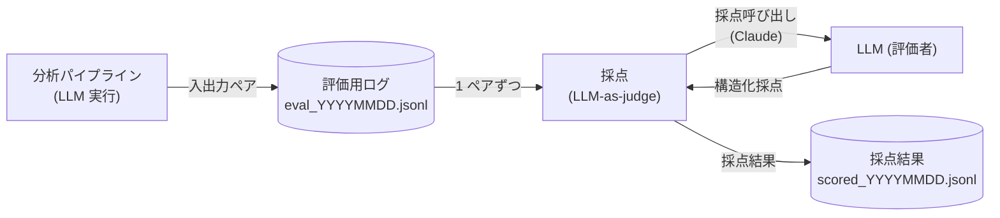

# LLM 出力評価 設計

md-patrol の **LLM 出力評価**（分析パイプラインが LLM に出させた判定の品質を、後から自動採点する処理）のコード設計をまとめます。分析パイプライン（[pipeline.md](pipeline.md)）が動くたびに LLM 入出力をログに残し、後で別の LLM（評価者）にそのログを採点させるまでの処理ロジックを記述します。全体の中での位置づけは [../architecture.md](../architecture.md) の「1.3 LLM 出力評価」を参照。

## 1. 概要

### 1.1 目的・対象範囲

LLM 出力評価は次の 2 段で構成され、本ドキュメントはこの一連の処理ロジックを定義します。

1. **評価用ログ記録** — 分析パイプラインの LLM 呼び出しのたびに、その入力（リクエスト）と出力（応答）をペアで日次ファイルに追記する。
2. **採点（LLM-as-judge）** — 後でまとめてログを読み、別の LLM（評価者＝judge）に 1 ペアずつ「妥当か」を採点させ、採点結果を別ファイルに書き出す。

> 狙いは、機能①②の LLM 判定が「捏造していないか・的外れでないか」を**人手をかけずに継続的に点検**できるようにすること。採点に正解データ（正解ラベル）は用意せず、入力と出力だけを根拠に評価する（reference-free 評価）。

### 1.2 処理フロー



### 1.3 実行タイミング・入力

- **評価用ログ記録**: 分析パイプラインの LLM 呼び出しのたびに 1 ペア追記する（オンライン・自動）。
- **採点**: 後からまとめて実行する（オフライン・手動／バッチ）。対象日付の評価用ログを読み、全ペアを採点する。
- **前提**: 採点も Claude（Anthropic API）を使うため API キーが必要（[5.1](#51-環境変数)）。

### 1.4 評価用ログと本番経路の分離

採点処理が呼ぶ LLM（評価者）は、分析パイプラインの LLM 呼び出しとは**別の窓口（別クライアント）**にする。採点呼び出しの入出力は評価用ログに残さない。

> もし採点呼び出しも評価用ログに記録すると、次の採点でその採点ログ自身が採点対象に混ざってしまう。評価対象は「分析パイプラインの判定」だけに限るため、採点経路を本番経路から切り離す。

## 2. 評価用ログ記録

分析パイプラインの LLM 呼び出し（[pipeline.md](pipeline.md) 4.4）のたびに、その入出力をペアで 1 行追記する。

1. LLM への窓口（`complete`）が Claude を呼んだ直後に、**送ったリクエストそのまま**と**返ってきた応答そのまま**をペアで記録する。
   - 記録は LLM への窓口からのみ行う（LLM 機能に閉じた関心事として LLM コンポーネント内に置く）。
2. 1 ペア＝1 レコードを、**日次ファイル**に追記する（[4.1](#41-保存形式)）。
3. ログ書き込みの失敗で**本処理（LLM 呼び出し）を止めない**。書き込みに失敗しても警告を出すだけで握りつぶし、分析パイプライン側の結果は通常どおり返す。

> 入力（リクエスト）には、機能ごとの tool スキーマと、候補一覧を埋め込んだ完成プロンプトがそのまま入る。これにより採点時に「どんな候補を渡して、どう答えたか」を後から完全に再現できる。
> ログ記録は分析の付随処理であって主処理ではない。ログが書けなくてもユーザーへの回答は返すべきなので、失敗は致命的に扱わない。

### 2.1 レコードが持つ情報

1 ペアのレコードが持つ情報。そのまま [4.2](#42-データ構造評価用ログ) のレコードになる。

| 項目 | 内容 |
|---|---|
| タイムスタンプ | 記録した日時 |
| 入力 | `messages.create` に渡したリクエスト（model / tools / tool_choice / messages 等）そのまま |
| 出力 | LLM の応答オブジェクトを dict 化したもの（tool_use の入力＝判定結果を含む） |

## 3. 採点（LLM-as-judge）

評価用ログを読み、1 ペアずつ別の LLM（評価者）に採点させる。

### 3.1 対象ログの選択

1. 採点対象の**日付**を指定して、その日の評価用ログ（`eval_YYYYMMDD.jsonl`）を読む。指定が無ければ当日を対象にする。
2. 対象ログが無ければ、その旨を知らせて終了する。
3. ログは **1 行 1 レコード**の JSON Lines として 1 件ずつ読み込む。1 レコードが複数行に割れていてパースできない場合は、その**行番号を添えて**分かりやすく知らせる。

### 3.2 採点プロンプトの組み立て

1. 各レコードの**入力**と**出力**を、採点用のプロンプト定型文の差し込み位置に埋め込む。
   - 入力・出力はそれぞれ整形した JSON 文字列にして差し込む。
2. プロンプト定型文（評価者の役割・評価観点・採点の指示）は、コードに直接書かず**外部ファイルの素材**として持つ。

> プロンプト定型文を外部ファイルにするのは、分析パイプラインのプロンプト（[pipeline.md](pipeline.md) 4.2）と同じ方針。評価観点の調整がコードを触らずにできる。
> 差し込む入力・出力には JSON（`{` `}`）が含まれるため、テンプレートの素朴な書式化（`{}` を特別扱いする置換）は使わず、目印文字列を単純に差し替える方式で埋め込む。

### 3.3 評価観点

評価者には、入力（渡した候補と完成プロンプト）と出力（LLM の判定）**だけ**を根拠に、次の観点で採点させる。正解データは渡さない（reference-free）。

1. **出典の実在性**: 出力が参照する候補 id は、入力の候補に実在するか（実在しない id の捏造は重大な減点）。
2. **引用の実在性**: 該当箇所の引用や食い違う記載など、本文からの引用は入力の候補本文に実在するか。
3. **判定の妥当性**:
   - 類似検索なら: 採用した候補は本当に入力と内容的に似ているか。無関係な候補を拾っていないか。
   - 矛盾チェックなら: 本当に両立しない矛盾か。単なる言い換え一致や話題違いを誤検出していないか。
4. **取りこぼし**: 入力の候補に、明らかに該当するのに出力へ含めていないものがないか。

> 観点は分析パイプラインの狙い（出典を候補 id に縛り、捏造を防ぐ）と対応する。捏造（実在しない id・引用）を最も重く見る。

### 3.4 構造化出力（tool スキーマ）

採点結果も自由文ではなく、**専用 tool スキーマに沿った構造化データ**で受け取る。評価者に当該ツールの呼び出しを強制し、その入力をそのまま採点結果として扱う（[pipeline.md](pipeline.md) 4.3 と同じ方式）。

採点結果の項目は次のとおり。

| 項目 | 内容 |
|---|---|
| `score` | 1〜5 の整数（5＝完全に妥当 / 3＝部分的に妥当 / 1＝不当・捏造あり） |
| `label` | `good`（妥当）/ `partial`（一部問題）/ `bad`（重大な問題） |
| `reason` | 評価観点に基づく採点理由の簡潔な説明 |
| `issues` | 具体的な問題点の配列。無ければ空配列 |

### 3.5 採点 LLM 呼び出し

1. 完成した採点プロンプトと採点 tool スキーマを LLM（評価者）に渡し、ツール呼び出しの入力（構造化採点）を受け取る。
2. 評価者へのアクセスは**採点専用の窓口（本番経路とは別クライアント）**に閉じ込め、採点呼び出しは評価用ログに残さない（[1.4](#14-評価用ログと本番経路の分離)）。

## 4. 出力

### 4.1 保存形式

| ファイル | 内容 | 書き込み方 |
|---|---|---|
| `logs/eval/eval_YYYYMMDD.jsonl` | 評価用ログ（分析パイプラインの LLM 入出力ペア） | 呼び出しのたびに 1 行**追記** |
| `logs/eval/scored_YYYYMMDD.jsonl` | 採点結果 | 採点実行ごとに**一括書き出し**（上書き） |

1. いずれも **1 行 1 レコードの JSON Lines**。日本語はエスケープせずそのまま保存する。
2. ファイル名の `YYYYMMDD` は日付。評価用ログは記録日、採点結果は採点対象日に対応する。

> JSON Lines にするのは、追記しやすく（評価用ログ）、1 行ずつ読み進めて採点しやすいため。1 レコードを必ず 1 行に収める（[3.1](#31-対象ログの選択)）。

### 4.2 データ構造（評価用ログ）

```json
{
  "timestamp": "記録日時",
  "input":  { "model": "...", "tools": ["..."], "tool_choice": {"...": "..."}, "messages": ["..."] },
  "output": { "content": [{"type": "tool_use", "input": {"results": ["..."]}}], "...": "..." }
}
```

| 項目 | 内容 |
|---|---|
| `timestamp` | 記録した日時 |
| `input` | `messages.create` に渡したリクエストそのまま |
| `output` | LLM の応答を dict 化したもの（tool_use の入力＝判定結果を含む） |

### 4.3 データ構造（採点結果）

```json
{
  "timestamp": "採点日時",
  "source":    { "timestamp": "...", "input": {"...": "..."}, "output": {"...": "..."} },
  "judge":     { "score": 5, "label": "good", "reason": "...", "issues": [] },
  "judge_model": "採点に使ったモデル名"
}
```

| 項目 | 内容 |
|---|---|
| `timestamp` | 採点した日時 |
| `source` | 採点元の評価用ログレコード（[4.2](#42-データ構造評価用ログ)）を丸ごと保持 |
| `judge` | 構造化採点（[3.4](#34-構造化出力tool-スキーマ)）。`score` / `label` / `reason` / `issues` |
| `judge_model` | 採点に使った評価者モデル名 |

> 採点結果は元ログに書き戻さず、`source` に元レコードを丸ごと抱えた**別ファイル**として残す。元の評価用ログを汚さず、何度でも採点をやり直せる。

## 5. パラメータ・環境変数

値は 1 箇所に集約し、後から調整しやすくする。

### 5.1 環境変数

| 環境変数 | 用途 |
|---|---|
| `ANTHROPIC_API_KEY` | 採点に使う Claude（Anthropic API）のキー。`.env` から読み込む |

### 5.2 調整パラメータ

| パラメータ | 既定値 | 説明 |
|---|---|---|
| 採点モデル | Claude（Anthropic） | 採点（評価者）に使うモデル。分析パイプラインと同じ設定を共用する |
| 採点対象日付 | 当日 | 採点する評価用ログの日付。指定が無ければ当日（[3.1](#31-対象ログの選択)） |
| 評価用ログ出力先 | `logs/eval/` | 評価用ログ・採点結果の置き場所 |

> 採点プロンプト（評価者の役割・評価観点・採点の指示）はコードに書かず外部ファイルの素材として持つ（[3.2](#32-採点プロンプトの組み立て)）。

## 6. 関連ドキュメント

- [../architecture.md](../architecture.md) — 全体構成（1.3 LLM 出力評価）
- [pipeline.md](pipeline.md) — 評価対象となる LLM 入出力を生む分析パイプラインの設計（機能①②共通）
- [rag-build.md](rag-build.md) — ベクトルストアの構築側の設計
