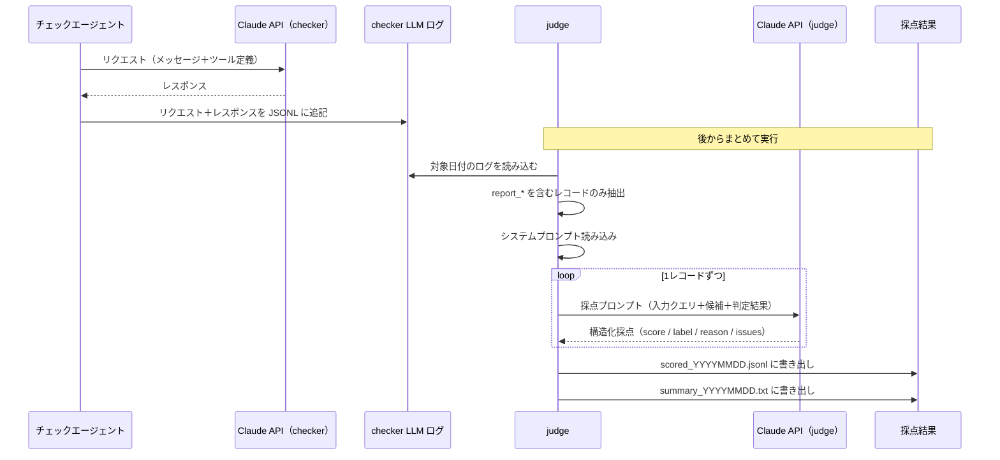

# LLM 出力評価 設計

md-checker の **LLM 出力評価**（エージェントが出した判定の品質を、後から別の LLM に採点させる処理）のコード設計をまとめます。全体の中での位置づけは [../architecture.md](../architecture.md) の「1.3 LLM 出力評価」を参照。

評価は 2 段で構成されます。① エージェントの LLM 呼び出しのたびに入出力ログを記録し、② 後からまとめてそのログを採点する。

## 1. 処理フロー

評価は「ログ記録」と「採点」の 2 フェーズに分かれます。

**ログ記録（チェック実行時・自動）**

1. md-checker が Claude API にリクエストを送る
2. レスポンスを受け取ったら、リクエスト＋レスポンスをペアで JSONL に追記する

**採点（後からまとめて実行）**

3. judge が対象日付の checker LLM ログを読み込む
4. `report_similar` または `report_conflicts` を含む最終判定ターンのレコードのみ抽出する
5. システムプロンプト（評価観点・採点指示）を読み込む
6. 1 レコードずつ採点プロンプトを組み立て、Claude API に投げる（`log_to_eval=False`）
7. 構造化採点結果（score / label / reason / issues）を受け取り、ファイルに書き出す



## 2. ログ記録（チェック実行時・自動）

チェックエージェントが Claude を呼び出すたびに、`infra/llm.py` の `run` がリクエストとレスポンスをペアで JSONL に追記する。エージェント側は意識しなくていい（`log_to_eval=True` が既定）。

- **記録対象**: `messages.create` に渡したリクエストそのまま ＋ 返ってきたレスポンスを dict 化したもの
- **出力先**: `logs/checker/llm_io_YYYYMMDD.jsonl`（日次・追記）
- ログ書き込み失敗は警告のみ。本処理（LLM 呼び出し）は止めない。

## 3. ログ読み込み・対象レコード抽出（採点時）

採点対象の日付を指定して checker LLM ログを読み込む。指定が無ければ当日。

- 1 行 1 レコードの JSON Lines として読み込む。
- **`report_similar` または `report_conflicts` を含むレコードのみ**を採点対象とする。ツールループでは複数回 LLM を呼ぶが、最終判定ターンだけを評価すればよいため。

## 4. システムプロンプト読み込み

採点者（judge）の役割・評価観点・採点指示を外部ファイル（`resources/prompts/judge.txt`）から読み込む。全レコード共通で使う。

## 5. 採点プロンプトの組み立てと LLM 呼び出し

1 レコードずつ採点プロンプトを組み立てて Claude に投げる。

**ユーザーメッセージに含めるもの:**
- 入力クエリ＋候補チャンク（ログの `request` の最初のユーザーメッセージ）
- 判定結果（ログの `response` の `report_similar` / `report_conflicts` tool_use の input）

**採点呼び出しの設定:**
- `log_to_eval=False` で呼ぶ。採点呼び出し自体が checker の評価対象ログに混入しないようにするため。
- `tool_choice` で `JUDGE_OUTPUT_SCHEMA` を強制し、構造化採点を受け取る。

**評価観点:**
1. **出典の実在性** — 参照している候補 id は入力の候補に実在するか（捏造は重大な減点）
2. **引用の実在性** — 引用や食い違う記載は候補本文に実在するか
3. **判定の妥当性** — 類似なら本当に似ているか、矛盾なら本当に両立しないか
4. **取りこぼし** — 明らかに該当するのに出力に含めていない候補がないか

## 6. 採点結果の書き出し

採点が終わったら 2 種類のファイルに一括書き出し（上書き）する。

| ファイル | 内容 |
|---|---|
| `logs/judge/scored_YYYYMMDD.jsonl` | 採点結果の詳細（1 行 1 レコード） |
| `logs/judge/summary_YYYYMMDD.txt` | スコア・ラベル・理由の一覧（人が読む用） |

judge 自身の LLM 入出力は `logs/judge/llm_io_YYYYMMDD.jsonl` に別途追記する（採点経路のトレース用）。

**採点結果のデータ構造:**

```json
{
  "timestamp": "採点日時",
  "source_timestamp": "採点元レコードの記録日時",
  "tool": "report_similar | report_conflicts",
  "judge": { "score": 9, "label": "good", "reason": "...", "issues": [] },
  "judge_model": "採点に使ったモデル名"
}
```

| 項目 | 内容 |
|---|---|
| `score` | 1〜10（10=完全に妥当 / 5=部分的 / 1=不当・捏造あり） |
| `label` | `good` / `partial` / `bad` |
| `reason` | 採点理由の簡潔な説明 |
| `issues` | 具体的な問題点の配列。無ければ空配列 |

## 7. パラメータ・環境変数

| 環境変数 | 用途 |
|---|---|
| `ANTHROPIC_API_KEY` | 採点に使う Claude のキー |

| パラメータ | 既定値 | 説明 |
|---|---|---|
| 採点モデル | `CLAUDE_MODEL` 共用 | 分析パイプラインと同じモデルを使う |
| 採点対象日付 | 当日 | 指定が無ければ当日の checker ログを対象にする |
| checker ログ出力先 | `logs/checker/` | `CHECKER_LLM_LOG_DIR` |
| 採点結果出力先 | `logs/judge/` | `JUDGE_LOG_DIR` |

## 8. 関連ドキュメント

- [../architecture.md](../architecture.md) — 全体構成（1.3 LLM 出力評価）
- [agent.md](agent.md) — 評価対象となる LLM 入出力を生む検索エージェントの設計
- [rag-build.md](rag-build.md) — ベクトルストアの構築側の設計
