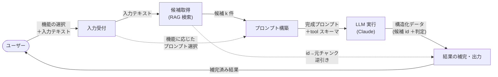
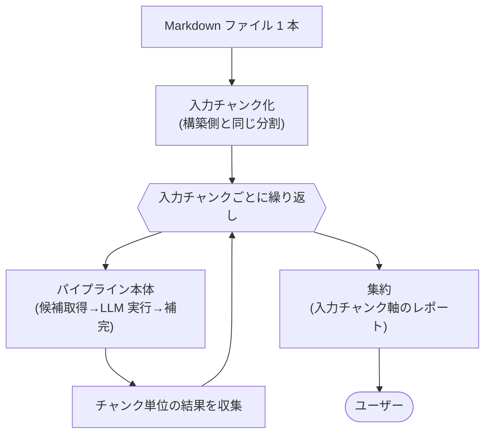

# 分析パイプライン 設計

md-checker の **検索フェーズ**（ユーザークエリのたびに動く処理）のコード設計をまとめます。ユーザーが入力した文章に対し、関連する既存記載を集め、LLM に判定させて回答を返すまでの処理ロジックを記述します。全体の中での位置づけは [../architecture.md](../architecture.md) の「1.2 md-checker エージェント」を参照。

機能①（類似記載の検索）と機能②（矛盾チェック）は、**同じパイプラインを共有**し、使うプロンプトだけが違います。本ドキュメントは両機能に共通の流れを定義します。

## 1. 概要

### 1.1 目的・対象範囲

検索フェーズは次の 4 段で構成され、本ドキュメントはこの一連の処理ロジックを定義します。

1. **入力受付** — どの機能を使うか（類似検索 / 矛盾チェック）と、入力単位（テキスト / ファイル）・対象を受け取る。
2. **候補取得（RAG 検索）** — 入力テキストでベクトルストアを検索し、関連しそうな記載を上位 k 件集める。
3. **プロンプト構築・LLM 実行** — 候補と入力をプロンプトに組み立て、機能ごとの **tool スキーマ**で LLM に判定させ、構造化データ（候補 id ＋判定）を得る。
4. **結果の補完・出力** — LLM が返した候補 id から元チャンクを逆引きし、ファイル名・見出し・本文を補ってユーザーに返す。

入力単位が**ファイル**の場合は、本体の外側で入力をチャンク化し、チャンクごとに上記 2〜4 を回してファイル単位に集約する（[7](#7-ファイル単位入力)）。

### 1.2 処理フロー



### 1.3 実行タイミング・入力

- **入力**: 使う機能（類似検索 / 矛盾チェック）の選択と、対象テキスト（直接入力した文章）。
- **実行**: ユーザーのクエリのたびに 1 回。
- **前提**: 事前にベクトルストアが構築済みであること（構築は [rag-build.md](rag-build.md)）。

### 1.4 二機能の共通化

機能①と②は「候補を集めて LLM に構造化出力で判定させ、id で元チャンクを補う」という骨格が同一で、違うのは **LLM に渡す指示（プロンプト）と、判定結果の形（tool スキーマ）だけ**です。そこでパイプライン本体は機能を意識せず、「どの機能か」を表す指定を受け取って、対応するプロンプトとスキーマを選ぶだけにしています。

> 検索・プロンプト組立・LLM 呼び出しは共通の部品に分離し、パイプラインは「流れ」をつなぐ役に徹する。機能を増やすときはプロンプトと tool スキーマを足すだけで済む。

## 2. 入力受付

1. ユーザーに使う機能（類似検索 / 矛盾チェック）を選ばせる。
2. 入力単位（**テキスト** / **ファイル**）を選ばせる。
3. 入力単位に応じて対象を受け取る。
   - **テキスト**: 対象テキスト（確認したい文章）を直接入力させる。空入力は受け付けない。また**最大入力文字数**（チャンク上限トークンに合わせ、既定 1200 文字）を超える入力は弾く。
   - **ファイル**: 対象 Markdown ファイルのパスを受け取る。本パイプラインの 3〜5 段に入る前に、ファイルを入力チャンクに分割して**チャンクごとにこのパイプラインを回す**（[8](#8-ファイル単位入力)）。この場合、上限文字数の検査は段の入口では行わない（チャンク化が分割を担うため）。
4. 受け取ったテキスト（テキスト単位ならそのまま、ファイル単位なら 1 入力チャンク分）を、以降の段に渡すクエリとする。

> 入力受付は表示・対話だけを担い、検索や LLM の詳細は持たない。長文（Markdown の一部など）もそのまま扱う前提。
> 3〜5 段（候補取得・LLM 実行・補完）は入力単位を意識しない。テキストでもファイルの 1 チャンクでも、渡されるのは「クエリ 1 本」であり、同じ処理をたどる。ファイル単位の「分割と集約」は本体の外側（[8](#8-ファイル単位入力)）に置く。

## 3. 候補取得（RAG 検索）

入力テキストをクエリとして、ハイブリッド検索（ベクトル＋語彙）で関連する記載を上位 k 件集める。検索の仕組みは構築済みベクトルストアを使い、2 系統の検索を統合する（詳細は [../architecture.md](../architecture.md) 1.2.1）。

1. 入力テキストをそのままクエリにする（切り詰めず渡す）。
2. 意味の近さ（ベクトル）と語彙の一致（BM25）の 2 系統を並行して検索し、順位を相互ランク融合で統合する。
3. 統合順位の上位 k 件を候補とする。各候補は「元ファイル名・見出しパス・本文」を持つ。
4. **同名ファイルの除外（任意）**: 除外対象ファイル名が渡されているときは、その `file` を持つ候補を結果から落とす。ファイル単位入力（[8](#8-ファイル単位入力)）で構築済みファイルを入力したときの自己マッチ回避に使う。テキスト単位や新規ファイル入力では除外対象が無く、実質ノーオプ。

> 取得件数 k は、最終的に必要な数より**多め**にする。本当に関連するか／矛盾するかの最終判断は後段の LLM に任せるため、候補を広めに集めて取りこぼしを防ぐ。
> 候補が 0 件なら（除外後に 0 件になった場合も含め）、LLM を呼ばずに「該当なし」を返す（無駄な呼び出しを避ける）。ファイル単位入力では、このスキップがチャンク数ぶんのコスト抑制に効く。

### 3.1 検索基盤の使い回し

1. ベクトルストアの読み込みと語彙検索の索引づくりは、クエリのたびに作り直さず、一度用意して使い回せるようにする。

> 同じセッションで繰り返し検索するとき、読み込みと索引構築のコストを毎回払わずに済む。

## 4. プロンプト構築・LLM 実行

集めた候補と入力テキストを組み合わせて、LLM に渡すプロンプトを作り、**機能ごとの tool スキーマに沿った構造化データ**として判定結果を得る。

### 4.1 候補の整形（id 付け）

1. 各候補を「id・ファイル名・見出しパス・本文」を 1 ブロックにまとめる（`infra/prompt.py` の `build_candidates_block`）。
2. 全候補のブロックを連結して、プロンプトに埋め込む候補テキストにする。

> 各ブロックの先頭に候補の **`id`** を明示するのは、LLM に**出典を id で参照させる**ため。回答のファイル名・見出しを、渡した候補に存在するものだけに縛り、実在しない出典の捏造（ハルシネーション）を防ぐ。
> 本文は構築時に検索用へ加工したものではなく、表示・判定に使える元の本文（コード込み）を渡す。

### 4.2 プロンプトの組み立て

1. 機能（類似検索 / 矛盾チェック）に応じて、対応するプロンプト定型文を選ぶ。
2. 定型文の中の差し込み位置に、**入力テキスト**と **4.1 の候補テキスト**を埋め込み、完成プロンプトにする。

> プロンプト定型文（役割・判定基準・出力の指示）は、コードに直接書かず**外部ファイルの素材**として持つ。文面の調整がコードを触らずにでき、機能ごとの違いも文面の差だけに閉じ込められる。
> 機能①は「似た記載か」を、機能②は「主張が食い違うか」を判定させる。骨格は同じで、判定基準の文面だけが異なる。

### 4.3 構造化出力（tool スキーマ）

回答は自由文ではなく、**機能ごとの tool スキーマに沿った構造化データ**で受け取る。LLM に当該ツールの呼び出しを強制し、その入力（ツールに渡す引数）をそのまま判定結果の構造化データとして扱う（テキスト応答や事後の JSON パースは挟まない）。

1. スキーマは機能ごとに 1 つ持つ。いずれも「判定した候補だけを、確からしさ／似ている度合いが高い順に並べた配列」を返す形にする。
   - **類似検索**: 各要素は「候補の **id**・似ている点の説明・該当箇所の短い引用」。
   - **矛盾チェック**: 各要素は「候補の **id**・入力側の主張・既存文書側の食い違う記載・矛盾の理由」。
2. どちらのスキーマも、**出典はファイル名や見出しではなく候補の `id`** で参照させる。ファイル名・見出し・本文は後段（[5](#5-結果の補完出力)）で id から逆引きして補うため、LLM には持たせない。
3. 該当する候補が無ければ、配列を空にして返させる。

> 構造化出力にする狙いは、回答を「渡した候補のどれか（id）＋判定」に縛ること。出典を id に限定することで、実在しないファイル名・見出しの捏造（ハルシネーション）を防ぐ。

### 4.4 LLM 呼び出し

1. 完成プロンプトと 4.3 の tool スキーマを LLM（Claude）に渡し、ツール呼び出しの入力（構造化データ）を受け取る。
2. LLM へのアクセス（モデル・呼び出しパラメータ・ツール強制）は専用の窓口に閉じ込め、パイプライン側は「プロンプトとスキーマを渡すと構造化データが返る」とだけ扱う。

> コストは候補 × 件数分の入力トークンが中心。候補を多めにすると精度は上がるが入力トークンも増えるトレードオフ。

## 5. 結果の補完・出力

LLM が返すのは「候補の id ＋判定」だけなので、id から元チャンクを逆引きして表示に必要な情報を補ってから出力する。

1. 候補（[3](#3-候補取得rag-検索)）を id 引きできるよう索引化する。
2. LLM が返した各要素の id で元チャンクを引き、**ファイル名・見出しパス・本文**を判定結果に補う。
3. id が候補に存在しない要素（取り違え・捏造）は捨てる。
4. 補った結果を機能ごとの体裁で表示する。
   - **類似検索**: ファイル名・見出し／似ている点／該当箇所。
   - **矛盾チェック**: ファイル名・見出し／入力側の主張／既存文書の記載／理由。
5. 候補が 0 件で LLM を呼ばなかった場合や、補完後に表示すべき結果が無い場合は、「該当なし」の旨を表示する。

> LLM には id しか出させず、表示用のファイル名・見出し・本文はプログラム側が渡した候補から補う。これにより出典が必ず実在の候補に対応し、捏造を物理的に排除できる。

## 6. パラメータ

値は 1 箇所に集約し、後から調整しやすくする。

| パラメータ | 既定値 | 説明 |
|---|---|---|
| 候補取得件数 k | 5 | RRF 統合後、LLM に渡す候補数（`CANDIDATE_K`、[3](#3-候補取得rag-検索)）。多いほど取りこぼしは減るが入力トークンが増える |
| 融合前取得件数 | 8 | 各検索（ベクトル / BM25）から融合前に取り寄せる母数（`PER_INDEX_K`、[3](#3-候補取得rag-検索)） |
| 最大入力文字数 | 1200 | 受け付ける入力テキストの上限（`MAX_INPUT_CHARS`、[2](#2-入力受付)）。チャンク上限トークンに合わせている。ファイル単位入力では適用しない |
| LLM モデル | `claude-sonnet-4-6` | 判定に使うモデル（`CLAUDE_MODEL`、[4.4](#44-llm-呼び出し)） |

> 検索の統合に関するパラメータ（各検索から取り寄せる母数や融合の定数）は検索基盤側に属する（[../architecture.md](../architecture.md) 1.2.1）。

## 7. ファイル単位入力

入力をテキスト 1 本ではなく **Markdown ファイル 1 本**にする場合の流れ。本パイプライン本体（[2](#2-入力受付)〜[5](#5-結果の補完出力)）は変えず、その**外側に「分割」と「集約」を 1 枚かぶせる**だけにする。

### 7.1 流れ



1. **入力チャンク化**: 入力ファイルを、**RAG 構築側と同じチャンク化器**（[rag-build.md](rag-build.md) 2）で分割する。粒度（H3 境界・1200 トークン上限・コードを割らない・文脈ヘッダ付与）が構築済みストアと揃うため、似た記載の対応づけが自然になる。
2. **チャンクごとに本体を実行**: 各入力チャンクの本文をクエリとして、パイプライン本体（[3](#3-候補取得rag-検索)〜[5](#5-結果の補完出力)）を 1 本ずつ**直列**で回す。本体側は入力がファイル由来であることを意識しない。
3. **集約**: チャンクごとの結果（[5](#5-結果の補完出力) の補完済み `{"results": [...]}`）を、**どの入力チャンク（入力側の見出しパス）に対する結果か**を添えて束ね、ファイル単位のレポートにする。

### 7.2 同名ファイルの除外（自己マッチ回避）

入力ファイルが**すでにストアに構築済み**の場合（既存文書の再点検）、各チャンクの検索で自分自身が最上位にヒットして判定が無意味になる。これを避けるため、**候補取得（[3](#3-候補取得rag-検索) 4）に入力ファイル名を渡して同名候補を除外**する。

- 入力ファイルが**新規（未構築）**なら、その名前はストアに無いので除外は何もマッチせず、自然に全候補が残る。
- よって新規／既存で処理を分岐させる必要はなく、「入力ファイル名を除外対象として常に渡す」だけで両方に対応できる。

### 7.3 出力形式

入力チャンクを軸にグルーピングしたレポートにする。チャンク単位の結果は既存の `{"results": [...]}` と同形のまま、その外側に入力チャンクの情報とサマリを足す。

```json
{
  "file": "draft.md",
  "summary": { "chunks": 7, "hit_chunks": 3, "results": 4 },
  "by_chunk": [
    {
      "input_heading": ["## 3. レート制限"],
      "results": [ "...パイプライン本体と同形の判定結果（id＋判定＋補完済み file/heading/本文）..." ]
    }
  ]
}
```

- **入力側の出典**は入力チャンクの見出しパスで示す（「ドラフトのどの見出しが引っかかったか」が分かる）。
- **既存側の出典**は従来どおり候補 id 逆引きで file/heading/本文を補完（[5](#5-結果の補完出力)）。後段の補完ロジックはチャンクごとにそのまま再利用する。
- 矛盾チェックでは、先頭にファイル全体のサマリ（食い違い件数など）を置くと実用的。
- 全チャンクで結果が無ければ「該当なし」を表示する。

### 7.4 パラメータ

| パラメータ | 既定値 | 説明 |
|---|---|---|
| 入力チャンク化器 | 構築側と同じ | 入力ファイルの分割（[7.1](#71-流れ)）。RAG 構築のチャンク化（[rag-build.md](rag-build.md) 2）を再利用 |
| 同名ファイル除外 | 入力ファイル名 | 候補取得に渡す除外対象（[7.2](#72-同名ファイルの除外自己マッチ回避)） |

> ファイル単位入力は固定パイプライン・検索エージェント（[agent.md](agent.md)）の**どちらの戦略でも回せる**。チャンクを 1 本ずつ流すだけなので、戦略側の処理（本体／ツールループ）には手を入れない。コストはチャンク数に比例して増えるため、候補 0 件チャンクのスキップ（[3](#3-候補取得rag-検索)）が効く。

## 8. 関連ドキュメント

- [../architecture.md](../architecture.md) — 全体構成（1.2 md-checker エージェント）
- [rag-build.md](rag-build.md) — このパイプラインが使うベクトルストアの構築側の設計。ファイル単位入力の入力チャンク化もこのチャンク化器を再利用する
- [agent.md](agent.md) — この固定パイプラインを拡張する検索エージェント（ツールループ）の設計
- [../reference/rag-basics.md](../reference/rag-basics.md) — RAG・ハイブリッド検索の基礎知識
