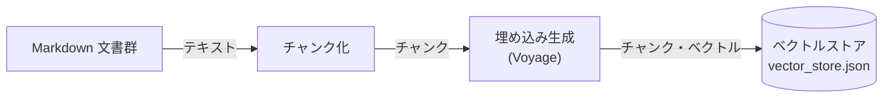

# RAG 構築 設計

md-patrol の **RAG 構築**（事前処理）のコード設計をまとめます。対象 Markdown を検索しやすい単位（チャンク）に整形し、ベクトル化して、ベクトルストアに保存するまでの処理ロジックを記述します。全体の中での位置づけは [../architecture.md](../architecture.md) の「1.1 RAG 構築」を参照。

## 1. 概要

### 1.1 目的・対象範囲

RAG 構築は次の 3 段で構成され、本ドキュメントはこの一連の処理ロジックを定義します。

1. **チャンク化** — Markdown を意味のまとまり単位に分割・整形する。
2. **埋め込み生成** — 各チャンクをベクトル化する（外部 API: Voyage）。
3. **ベクトルストア保存** — チャンク本文・ベクトル・メタ情報をローカル JSON に保存する。

### 1.2 処理フロー



### 1.3 実行タイミング・入力

- **入力**: 対象フォルダ内の Markdown 文書群（`.md`）。
- **実行**: 事前処理として 1 回。全ファイルをまとめて処理する。文書を追加・変更したら再実行（全件再構築）。
- **前提**: 対象は小規模（数十ファイル程度）。

## 2. チャンク化

1 ファイルごとに次の順で処理する。

```
画像除去 → 一次分割 → （上限超のみ）二次分割 → 文脈ヘッダ付与 → チャンク確定
```

### 2.1 画像リンクの除去

1. 本文から画像リンク（``）をすべて削除する。

> 画像 URL はベクトル化に寄与しないため。最初に消して以降の処理に影響させない。

### 2.2 一次分割（見出し単位）

1. 行を上から走査し、見出し（`#`）でセクションに区切る。
   - 区切りに使うのは **H3（`###`）**。H3 が無ければ **H2（`##`）**。
   - **H1 は区切らない**（ファイルタイトル扱い。文脈ヘッダ用に保持のみ）。
2. 各セクションに **見出しパス**（到達までの見出しの並び。例: `["4. プロンプトキャッシュ", "4.2 会話アプリ..."]`）を持たせる。
3. ` ``` ` の開始/終了を追跡し、**コードブロック内の `#` は見出しとみなさない**。

> 見出しは書き手による自然な意味の区切り。短いチャンクが増えても問題ない（文脈が切れている証拠）。

### 2.3 二次分割（トークン上限超のときのみ）

1. セクション（文脈ヘッダ込み）が **上限トークン以内**ならそのまま 1 チャンク。
2. 超える場合のみ、段落（空行）境界で再分割する。
   1. 本文を「コードブロック」と「テキスト」のブロックに分解する。
   2. ブロックを先頭から順にチャンクへ詰める（テキストは段落単位で追加可）。
   3. 追加すると上限を超えるところでチャンクを確定し、次のチャンクを始める。
3. **コードブロックは途中で割らず、丸ごと 1 つに入れる**。

> 上限超のときだけ割って細切れを防ぐ。コードは意味の最小単位なので途中分割しない。

### 2.4 コードブロックの扱い

チャンクは用途別に 2 種類のテキストを持ち、コードの扱いを変える。

| テキスト | コード | 用途 |
|---|---|---|
| 本文（コード込み） | 残す | 結果表示・LLM への矛盾判定 |
| 埋め込み用テキスト | 除く | ベクトル化（意味検索）の材料 |

1. 埋め込み用テキストを作るときだけ、コードブロック（` ``` ～ ``` `）を丸ごと除去する。

> コードの記号列は意味照合ではノイズ＝偽陽性の元。語彙検索・本文には必要なので残す。
> コード除去で本文が空になっても、文脈ヘッダ（見出し語）が残るため見出しベースの類似検索は効く。

### 2.5 文脈ヘッダの付与

1. 本文・埋め込み用テキストの**先頭に文脈ヘッダ**を付ける。
   - 形式: `[ファイル名 > 見出し > 見出し > ...]`（ファイル名 ＋ 2.2 の見出しパスから組み立て）
   - 例: `[claude-feature.md > 4. プロンプトキャッシュ > 4.2 会話アプリにおける課題]`

> チャンク単体でも「どのファイルのどの見出しか」を保持。ベクトル化・回答生成の文脈維持に効き、語彙検索でも見出し語がヒットする。

### 2.6 チャンクが持つ情報

確定したチャンクが持つ情報。そのまま [4.2](#42-データ構造) のレコードになる。

| 情報 | 内容 |
|---|---|
| 本文 | 文脈ヘッダ ＋ 本文（**コード込み**）。結果表示・LLM 判定に使う |
| 埋め込み用テキスト | 文脈ヘッダ ＋ 本文（**コード除去**）。ベクトル化に使う |
| ファイル名 | 元の Markdown ファイル名 |
| 見出しパス | 2.2 で保持した見出しの並び（メタ情報） |

## 3. 埋め込み生成

全チャンクの **埋め込み用テキスト（コード除去後）** をベクトル化する。

### 3.1 使用モデルと外部 API 呼び出し

1. 埋め込みは **Voyage の埋め込みモデル**（外部 API）を使う。API キーが必要（[5.1](#51-環境変数)）。
2. 各チャンクの **埋め込み用テキスト**を入力にする（本文＝コード込みは使わない）。

> 埋め込みは検索精度の中核。検索・RAG 用途に強い Voyage を充てる。
> コードを除く理由は [2.4](#24-コードブロックの扱い方針-c) と同じ。

### 3.2 バッチ処理・失敗時

1. 複数チャンクを**まとめて 1 リクエスト**で投げる（呼び出し回数を抑える）。
2. API のバッチ件数・入力トークン上限を超えるなら分割して複数回呼ぶ。
3. 返ったベクトルを**入力と同じ順序**でチャンクに対応づける。
4. レート制限・一時エラーは**リトライ**する。

> 構築時 1 回のみ。課金は総トークン量基準で、チャンクの大小で合計はほぼ変わらない（＝安価）。

## 4. ベクトルストア

### 4.1 保存形式

1. チャンク本文・ベクトル・メタ情報を **1 つのローカル JSON ファイル**（`vector_store.json`）に保存する。

> 小規模（50 ファイル未満）で検索は全件総当たりでも十分速く、専用 DB の索引の旨みが出ない。BM25・RRF はどのみち自前実装が要るため専用 DB の利点が薄い。

### 4.2 データ構造

- トップに埋め込みモデル名、その下にレコード配列を持つ。

> モデル名を保存するのは、検索時にクエリを同じモデルでベクトル化して意味空間を揃えるため。

```json
{
  "model": "<埋め込みモデル名>",
  "records": [
    {
      "content":      "文脈ヘッダ ＋ 本文（コード込み）",
      "embed_text":   "文脈ヘッダ ＋ 本文（コード除去）",
      "file":         "元ファイル名",
      "heading_path": ["見出し", "..."],
      "embedding":    [0.012, -0.034, "..."]
    }
  ]
}
```

| 項目 | 内容 |
|---|---|
| `content` | 本文（コード込み）。結果表示・LLM 判定で使う |
| `embed_text` | 埋め込み用テキスト（コード除去）。ベクトル化に使ったもの（確認用に保存） |
| `file` | 元ファイル名 |
| `heading_path` | 見出しパス（メタ情報） |
| `embedding` | `embed_text` の埋め込みベクトル（次元数は使用モデルに依存） |

### 4.3 保存・上書き・再構築

1. 全ファイルのレコードをそろえてから JSON を**一括書き出し**（既存は上書き）。
2. 日本語はエスケープせずそのまま保存する。
3. 文書を追加・変更したら**全件再構築**（差分更新はしない）。

> 埋め込みが安価なため全件再構築でも実コストは小さい。

## 5. パラメータ・環境変数

値は 1 箇所に集約し、後から調整しやすくする。

### 5.1 環境変数

| 環境変数 | 用途 |
|---|---|
| `VOYAGE_API_KEY` | Voyage 埋め込み API のキー。`.env` から読み込む |

### 5.2 調整パラメータ

| パラメータ | 既定値 | 説明 |
|---|---|---|
| チャンク上限トークン | 約 1200 | 超えたセクションのみ二次分割（[2.3](#23-二次分割トークン上限超のときのみ)）。変更時は再構築が必要 |
| 埋め込みモデル名 | Voyage の埋め込みモデル | ベクトル化に使うモデル。ストアの `model` にも記録 |

## 6. 関連ドキュメント

- [../architecture.md](../architecture.md) — 全体構成（1.1 RAG 構築）
- [pipeline.md](pipeline.md) — このチャンク・ストアを使う検索側の設計（分析パイプライン・機能①②共通）
